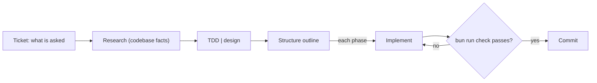
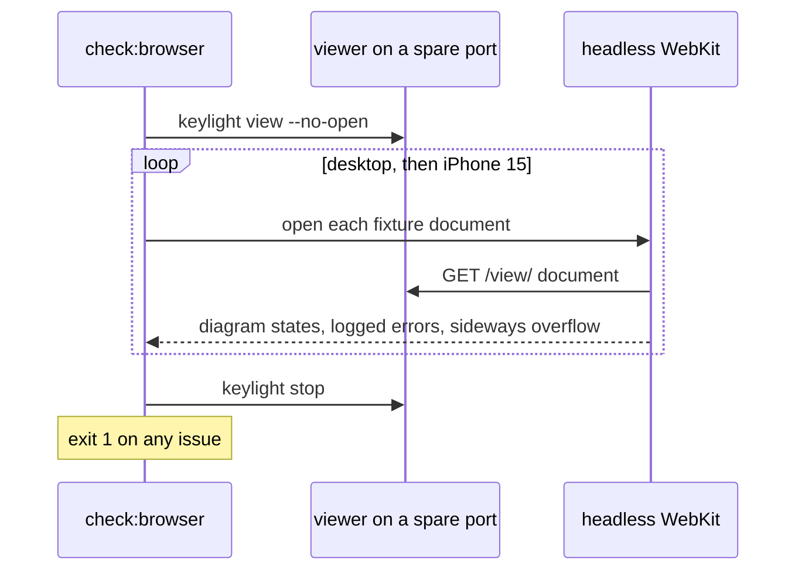
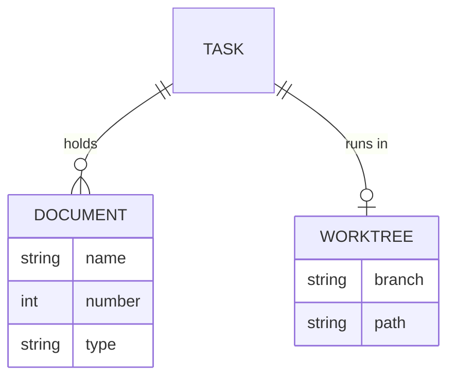
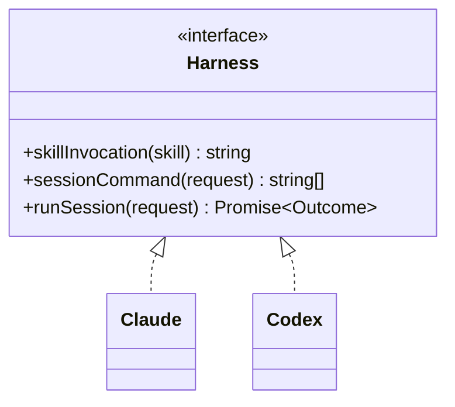

# Diagrams

One of each Mermaid diagram type the workflow's documents use.

## Flowchart

```mermaid
flowchart LR
    ticket["Ticket: what is asked"] --> research["Research (codebase facts)"]
    research --> tdd["TDD | design"]
    tdd --> outline["Structure outline"]
    outline -->|"each phase"| implement["Implement"]
    implement --> check{"bun run check passes?"}
    check -->|yes| commit["Commit"]
    check -->|no| implement
```

## Sequence diagram

```mermaid
sequenceDiagram
    participant C as check:browser
    participant V as viewer on a spare port
    participant W as headless WebKit
    C->>V: keylight view --no-open
    loop desktop, then iPhone 15
        C->>W: open each fixture document
        W->>V: GET /view/ document
        W-->>C: diagram states, logged errors, sideways overflow
    end
    C->>V: keylight stop
    Note over C: exit 1 on any issue
```

## Entity relationship diagram

```mermaid
erDiagram
    TASK ||--o{ DOCUMENT : holds
    TASK ||--o| WORKTREE : "runs in"
    DOCUMENT {
        string name
        int number
        string type
    }
    WORKTREE {
        string branch
        string path
    }
```

## Class diagram

```mermaid
classDiagram
    class Harness {
        <<interface>>
        +skillInvocation(skill) string
        +sessionCommand(request) string[]
        +runSession(request) Promise~Outcome~
    }
    class Claude
    class Codex
    Harness <|.. Claude
    Harness <|.. Codex
```
